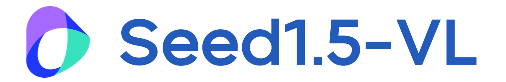

🌐 <a href=""> Homepage (upcoming)</a>&nbsp&nbsp | &nbsp&nbsp🤗 <a href="https://huggingface.co">Hugging Face (upcoming)</a>&nbsp&nbsp | &nbsp&nbsp📄 <a href="https://arxiv.org/abs/">arXiv (upcoming)</a>

## 🌟 Highlights

* Seed1.5-VL is a vision-language foundation model featuring a 532M-parameter vision encoder and a 20B active parameter Mixture-of-Experts (MoE) LLM, designed to advance general-purpose multimodal understanding and reasoning.

* Seed1.5-VL delivers strong performance across numerous public benchmarks, achieving state-of-the-art results in areas including multimodal reasoning and agent-centric tasks.

* This repository offers usage cookbook and best practices designed to help developers effectively use Seed1.5-VL.

## 📢 News
* `2025-05-12:` We have released the [Seed1.5-VL Technical Report](./Seed1.5-VL-Technical-Report.pdf).
* `2025-05-12`: We are extremely delighted to release the flagship Seed1.5-VL on Volcano Engine. The model id is `doubao-1-5-thinking-vision-pro-250428`. You can try it now!

## 📖 Seed1.5-VL Cookbook

Welcome to the **Seed1.5-VL** API Cookbook! This collection of code samples is designed to help you get started with using the Seed1.5-VL API. Our flagship Seed1.5-VL has been deployed on [Volcano Engine](https://www.volcengine.com/product/doubao). After obtaining your `API_KEY`, you can use the examples in this cookbook to rapidly understand and leverage the diverse capabilities of our Seed1.5-VL.

### Quick Start

- [x] Cookbook for online/offline [Gradio Demo](./GradioDemo)
- [x] Cookbook for turning on/off [LongCoT](./longCoT)
- [x] Cookbook for [2D Grounding](./Grounding)
- [x] Cookbook for [3D Understanding](./3D-Understanding)
- [x] Cookbook for [Video Understanding](./Video)

## License
This repo is under [Apache-2.0 License](./LICENSE).

## About [ByteDance Seed Team](https://seed.bytedance.com/)

Founded in 2023, ByteDance Seed Team is dedicated to crafting the industry's most advanced AI foundation models. The team aspires to become a world-class research team and make significant contributions to the advancement of science and society.
